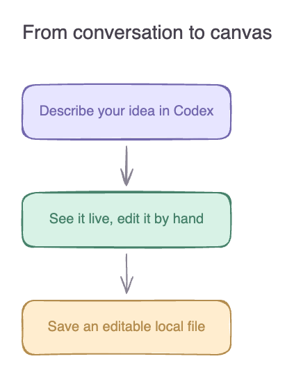

# excalidraw-codex

[English](README.md) | **简体中文**

用 Codex 描述想法，在画布上继续编辑，保存为可编辑文件。

`excalidraw-codex` 将 Excalidraw 编辑器带到 Codex 侧边面板。你可以通过对话创建流程图、架构图或草图，再直接拖动形状、修改文字。后续对话会基于当前画布继续修改，包括你手动做出的调整。



## 你可以做什么

- 通过自然语言创建和修改图表。
- 在实时 Excalidraw 编辑器中调整形状、文字和连接箭头。
- 自动保存为项目中的标准 `.excalidraw` 文件。
- 导出 PNG 和 SVG，用于文档、演示和分享。
- 从本地历史版本恢复，检测多个来源同时修改产生的冲突。

插件使用 Excalidraw 0.18.1 和 Codex 应用的浏览器面板。这是采用 MIT 许可证的独立项目，无需额外的绘图服务账户或 API key。

## 安装

安装流程已在 macOS 验证。你需要：

- 支持插件和内置浏览器面板的 Codex 桌面版，以及可在 `PATH` 中调用的 `codex` CLI。
- 从源码构建需要 Node.js **22.12+** 和 npm；已打包插件运行时仅需 Node.js 20+。
- 本地安装需要 `python3`、`rsync` 和 Codex 的 `plugin-creator` 系统技能。

将源码下载或克隆到用户主目录下的一个文件夹，然后在该目录运行：

```sh
git clone https://github.com/korbinjoe/excalidraw-codex.git ~/excalidraw-codex
cd ~/excalidraw-codex
npm ci
npm run codex:register
npm run codex:update
```

注册命令会在个人市场创建或更新插件条目，备份已有目录配置并保留其他条目。更新命令依次完成测试、构建、校验、安装和安装文件验证。自定义工具位置及旧名称迁移方法见[开发说明](docs/DEVELOPMENT.md)。

**安装后新建一个 Codex 任务**，使其加载新版 Skill。

## 开始使用

告诉 Codex：

> 用 excalidraw-codex 画一个登录流程图，在侧边面板打开，并保存到当前项目的 diagrams/login.excalidraw。

然后继续：

> 在密码验证之后加上双重认证分支。

> 保留我调整的布局，把 API 节点改名为认证服务，然后导出 SVG。

你也可以直接在面板拖动形状、修改文字或绘图。Codex 修改图表和导出图片时需要使用实时编辑器，因此请保持面板打开。再次编辑时，让 Codex 打开相应的 `.excalidraw` 文件即可。

自动连线以直线路由作为起点。复杂图表可以让 Codex 继续调整布局，并检查导出的预览。

## 文件、隐私与恢复

`.excalidraw` 文件保存了图表，可在其他兼容编辑器中打开。手动修改通常在约 250 ms 后自动保存，关闭面板前请确认状态显示 **Saved**。崩溃可能导致尚未保存的修改丢失。

插件从本地提供编辑器和字体，仅监听 `127.0.0.1`，并使用随机会话令牌保护 API。插件不会将图表上传到绘图服务。Codex 本身如何处理你的请求及读取的场景数据，取决于你的 Codex 设置。

最近 30 个历史版本位于：

```text
~/.local/state/codex-excalidraw-canvas/<file-hash>/history/
```

这里有意保留旧目录名称，以便重命名后仍能找到已有会话和历史记录。

如果其他程序或面板同时修改文件，编辑器会提示冲突。先点击 **Download a copy** 下载当前副本，再点击 **Reload** 重新载入，以保留未保存的编辑。恢复历史版本时，让 Codex 停止对应画布，将选中的历史文件复制为新的 `.excalidraw` 文件，再打开该副本。

## 常见问题

| 问题 | 处理方式 |
| --- | --- |
| Codex 没有发现插件 | 安装后新建任务，并检查 `codex plugin list`。 |
| 绘图命令提示需要面板 | 让 Codex 在侧边面板重新打开画布，等待连接完成。 |
| 命令超时 | 让 Codex 先读取当前场景再重试，操作可能已经保存。 |
| 服务重启或恢复的标签页无法连接 | 让 Codex 重新打开文件，获取新的本地 URL。 |
| 已有画布没有显示更新 | 确认保存后，让 Codex 停止并重新打开该画布。已启动的服务仍使用原来的后端。 |
| 客户端没有内置浏览器 | 在浏览器中打开返回的本地 URL。侧边面板体验需要兼容的 Codex 桌面版。 |

## 开发与贡献

欢迎贡献。环境准备与检查方法见 [CONTRIBUTING.md](CONTRIBUTING.md)，打包与安装流程见[开发指南](docs/DEVELOPMENT.md)，已验证的行为及限制见[验证记录](docs/VALIDATION.md)。

项目代码、界面、示例和贡献者文档统一使用英文。README 提供英文和简体中文版本。

## 许可证与致谢

[MIT License](LICENSE) · Copyright (c) 2026 Joebon。

基于 [Excalidraw](https://github.com/excalidraw/excalidraw)、React 和 Vite 构建。依赖保留各自许可证，详见 [THIRD_PARTY_NOTICES.txt](THIRD_PARTY_NOTICES.txt)。本项目与 OpenAI、Excalidraw 项目无隶属或背书关系。
